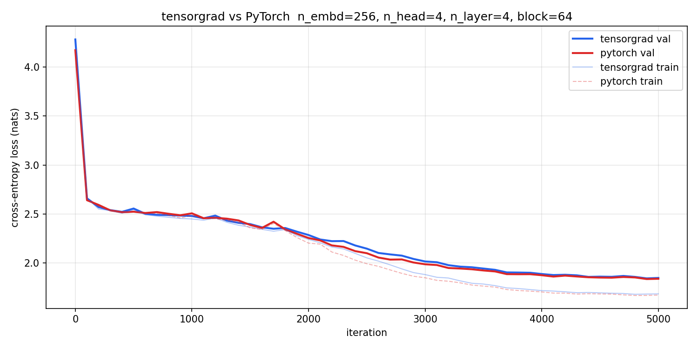

# tensorgrad

A tensor-level autograd engine built from scratch in NumPy. Trains a GPT
without touching PyTorch.

`microgradplus` operates at the scalar level: every number in the network is
an individual `Value` node, and the computation graph grows one scalar
operation at a time. This is the right level for understanding *why* autograd
works, but scalar graphs become impractically large the moment you add a matrix
multiply a single `(32, 256) @ (256, 256)` produces 8 192 individual nodes
and 8 192 backward closures, all for one linear layer.

`tensorgrad` lifts the engine to the tensor level. Operations like `matmul`,
`layernorm`, `softmax`, and `cross_entropy` are tracked as single nodes with
hand-derived matrix gradients. The graph stays small, the math stays explicit,
and the end result is a GPT trained entirely without PyTorch.

```bash
git clone https://github.com/Nur2424/tensorgrad
cd tensorgrad
pip install -e .
```

## Structure

```
tensorgrad/
├── engine.py      # Tensor class: n-dimensional autograd
├── functional.py  # matmul, softmax, cross_entropy, layernorm, ...
├── nn.py          # Linear, LayerNorm, CausalSelfAttention, GPTNano
└── optim.py       # AdamW

tests/
├── test_engine.py      # Tensor ops + backward, checked against PyTorch
├── test_functional.py  # functional gradients vs PyTorch autograd
├── test_nn.py          # module forward passes
└── test_optim.py       # AdamW parameter updates

notebooks/
├── 01_tensor_backward_derivations.ipynb  # matrix gradient derivations
└── 02_gpt_training.ipynb                 # loads checkpoint + loss curves, training notes 

examples/
└── train_gpt.py   # trains GPTNano on Shakespeare, saves checkpoint + plots
```

## Quick start

**Forward pass:**

```python
import numpy as np
from tensorgrad.nn import GPTNano

model = GPTNano(vocab_size=65, n_embd=256, n_head=4, n_layer=4, block_size=64)
print(f"{model.num_params():,} parameters")  # 2,683,201

x      = np.array([[18, 47, 56, 57, 58]])   # (B, T) token indices
logits = model(x)                            # (B, T, vocab_size) — (1, 5, 65)
```

**Full training run** (90–100 minutes on CPU):

```bash
python examples/train_gpt.py
```

Saves weights to `outputs/checkpoints/tg_model.npz` and loss curves to
`outputs/plots/training_loss.png`. The notebook `notebooks/02_gpt_training.ipynb`
loads the checkpoint and generates text without retraining.

## The engine

Everything is built on one class, `Tensor`, which wraps a NumPy array and
records the operation that produced it:

```python
from tensorgrad.engine import Tensor

a = Tensor(np.random.randn(4, 8))
b = Tensor(np.random.randn(8, 4))
c = a @ b          # (4, 4) matmul tracked as a single node
d = c.relu()
e = d.sum()

e.backward()
print(a.grad.shape)  # (4, 8)
print(b.grad.shape)  # (8, 4)
```

Each operation attaches a closure containing its local gradient rule to the
output node. `.backward()` builds a reverse topological ordering via DFS and
calls each closure in order. This is identical to `microgradplus` in
structure — the difference is that each closure now computes a matrix gradient
rather than a scalar one.

| tensorgrad | PyTorch equivalent |
|---|---|
| `Tensor` | `torch.Tensor` with `requires_grad=True` |
| `_prev`, `_op` | autograd graph (`grad_fn` chain) |
| `_backward` closure | `Function.backward` |
| `Tensor.backward()` | `Tensor.backward()` |
| `AdamW.zero_grad()` | `optimizer.zero_grad()` |
| `AdamW.step()` | `optimizer.step()` |

## Training GPT on Shakespeare

`examples/train_gpt.py` trains a character-level GPT on the full 1.1M
character Tinyshakespeare dataset and runs an identical PyTorch model
alongside it for direct comparison. Both models share the same
hyperparameters, the same data batches (same NumPy RNG seed), and the same
initialisation scheme.

**Architecture:** pre-norm transformer (GPT-2 convention), combined `c_attn`
projection (`n_embd => 3 * n_embd`), `LayerNorm` before each sublayer.

**Training:** cosine LR decay `lr(t) = lr_0 * 1/2 * (1 + cos(π * t / T))`, 
gradient clipping (global norm =< 1.0), 5 000 steps.

```
n_embd=256  n_head=4  n_layer=4  block_size=64  batch=32  lr=3e-3
```

| | val loss | parameters |
|---|---|---|
| tensorgrad | **1.8467** | 2 683 201 |
| PyTorch | **1.8381** | 2 683 201 |
| \|diff\| | **0.0085** | — |

The 0.0085 gap is numerical noise from float64 (NumPy) vs float32 (PyTorch),
not a gradient error. Both engines converge to the same region of the loss
surface.



**Sample (temperature 0.8, prompt `ROMEO:`):**
```
ROMEO:
I duke to pros have be to a des your at senellouty,
Whe wilt the sto the pray loooos in these.

For your here say, my lord sale unsore met
Which mild runting, how I inck be not
And that as be the stone are his of milloble;
Your prove to stagate my into to and make in heaven
she all such sight, the how the to you gail love
The of a new chailt.


QUEEN OF York's way my not all I maninght
The wheen sorrow, we and to the god our grave
hing a set our the her ballume of Romeo.
```

## Correctness

Every operation in `engine.py` and `functional.py` is tested against
PyTorch's autograd on identical inputs. All tests pass on NumPy 1.26 /
Python 3.11.

```bash
pip install -e ".[dev]"
pytest -v
```

The gradient check for `matmul` (`A @ B => dL/dA = dL/dC @ B^T`,
`dL/dB = A^T @ dL/dC`) is the single identity that makes tensor-level
autograd efficient. Verifying it numerically before building anything on top
of it is the point of `test_engine.py`.

## Design choices

**Tensor gradients are derived, not looked up.** Every gradient rule in
`functional.py` is derived from first principles the chain rule applied to
matrix expressions not copied from a reference implementation. For example,
the `softmax` + `cross_entropy` gradient collapses to `(p - y) / B` (the same
identity derived in `microgradplus/notebooks/02_softmax_cce.ipynb`), which is
why they are fused into a single `cross_entropy` node rather than two
separate ones.

**AdamW decouples weight decay from the gradient.** The optimizer applies
weight decay directly to the parameter (`p <= p - lr * wd * p`) rather than
folding it into the gradient. This matches the GPT-2 training setup and is
derived from Loshchilov & Hutter (2019).

**The graph is dynamic.** The computation graph is built fresh each forward
pass, exactly as in `microgradplus` and PyTorch's eager mode. There is no
compilation step.

## What this is not

This is a learning and portfolio project, not a production framework. There is
no GPU support, no kernel fusion, no mixed precision, and no gradient
checkpointing. The engineering that PyTorch adds on top of the same
mathematics CUDA kernels, graph compilation, distributed training is real
and substantial. The point here is that the mathematical content underneath is
exactly this.

## The notebooks

`notebooks/01_tensor_backward_derivations.ipynb` derives the matrix gradients
for each operation in `functional.py` from scratch: `matmul`, `softmax`,
`cross_entropy`, `layernorm`. Every result is checked numerically before it
enters the library.

`notebooks/02_gpt_training.ipynb` loads the pre-trained checkpoint, plots the
tensorgrad vs PyTorch loss curves, and generates Shakespeare from the saved
weights without retraining.

## References

- **GPT-2** — Radford et al. (2019). *Language Models are Unsupervised
  Multitask Learners.* The architecture implemented in `nn.py`.
- **Attention Is All You Need** — Vaswani et al. (2017).
  [arxiv.org/abs/1706.03762](https://arxiv.org/abs/1706.03762)
- **AdamW** — Loshchilov & Hutter (2019). *Decoupled Weight Decay
  Regularization.* [arxiv.org/abs/1711.05101](https://arxiv.org/abs/1711.05101)
- **Layer Normalization** — Ba et al. (2016).
  [arxiv.org/abs/1607.06450](https://arxiv.org/abs/1607.06450)

## Related repositories

**[microgradplus](https://github.com/Nur2424/microgradplus)** — the scalar
autograd engine. The right starting point for understanding why autograd works.
`tensorgrad` is the natural next step: same engine structure, same mathematical
content, tensor operations instead of scalar ones.

**[language-models-from-scratch](https://github.com/Nur2424/language-models-from-scratch)**
— the same GPT architecture trained in PyTorch, with full derivations of every
design decision from bigram counts up to causal self-attention. `tensorgrad`
replaces PyTorch's autograd with hand-written tensor gradients and reaches the
same loss.

| Repository | Level | What it shows |
|---|---|---|
| `microgradplus` | scalar | autograd from first principles |
| `tensorgrad` | tensor | efficient gradients through matrix operations |
| `language-models-from-scratch` | model | applying autograd to build GPT-style models |
